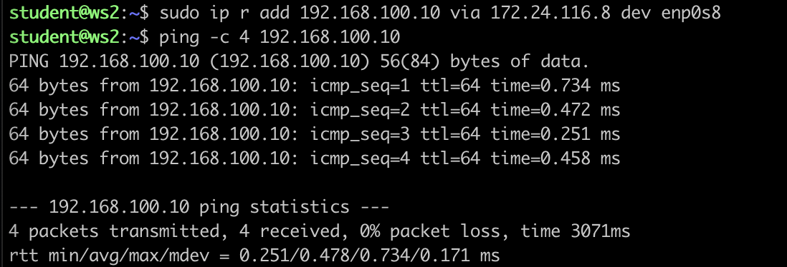
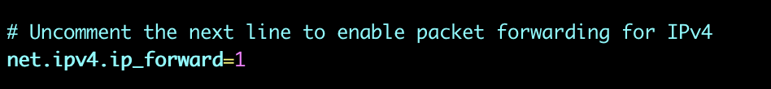
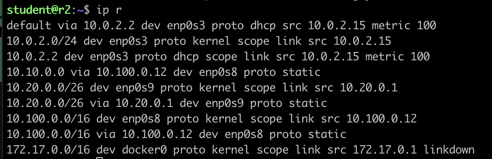
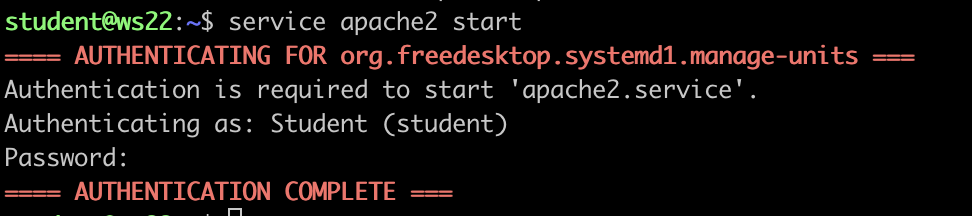

>karleenk: \
>Цифорок много - глаза могут устать (@_@)

## Contents

1. [Chapter I](#chapter-i) \
   1.1. [Инструмент ipcalc](#part-1-инструмент-ipcalc) \
   1.2. [Статическая маршрутизация между двумя машинами](#part-2-статическая-маршрутизация-между-двумя-машинами) \
   1.3. [Утилита iperf3](#part-3-утилита-iperf3) \
   1.4. [Сетевой экран](#part-4-сетевой-экран) \
   1.5. [Статическая маршрутизация сети](#part-5-статическая-маршрутизация-сети) \
   1.6. [Динамическая настройка IP с помощью DHCP](#part-6-динамическая-настройка-ip-с-помощью-dhcp) \
   1.7. [NAT](#part-7-nat) \
   1.8. [Допополнительно. Знакомство с SSH Tunnels](#part-8-дополнительно-знакомство-с-ssh-tunnels)

## Part 1. Инструмент **ipcalc**

#### 1.1. Сети и маски

1) Адрес сети *192.167.38.54/13* - 192.167.0.0/13

2) Перевод маски 
    *255.255.255.0* - 11111111 11111111 11111111 00000000, */24
    */15* - 11111111 11111110 00000000 00000000, 255.254.0.0
    *11111111.11111111.11111111.11110000* - 255.255.255.240, */28
    
3) Минимальный и максимальный хост в сети *12.167.38.4* при масках:
    */8* - min - 12.0.0.1 , max - 12.255.255.254
    *11111111.11111111.00000000.00000000* - min 12.167.0.1 , max - 12.167.255.254
    *255.255.254.0* - min - 12.167.38.1 , max - 12.167.39.254
    */4* - min - 0.0.0.1 , max - 15.255.255.254

1.2. localhost
Определить и записать в отчёт, можно ли обратиться к приложению, работающему на localhost, со следующими IP:
*194.34.23.100* - no (it's not localhost)
*127.0.0.2* - yes
*127.1.0.1* - yes
*128.0.0.1* - no (it's not local host)

1.3. Диапазоны и сегменты сетей
Определить и записать в отчёт:

1) какие из перечисленных IP можно использовать в качестве публичного, а какие только в качестве частных:
*10.0.0.45* - priv
*134.43.0.2* - pub
*192.168.4.2* - priv
*172.20.250.4* - priv
*172.0.2.1* - pub
*192.172.0.1* - pub
*172.68.0.2* - pub 
*172.16.255.255* - priv
*10.10.10.10* - priv
*192.169.168.1* - pub

2) какие из перечисленных IP адресов шлюза возможны у сети *10.10.0.0/18*: 
*10.0.0.1* - no
*10.10.0.2* - yes
*10.10.10.10* - yes
*10.10.100.1* - no
*10.10.1.255* - yes

## Part 2. Статическая маршрутизация между двумя машинами

С помощью команды `ip a` посмотреть существующие сетевые интерфейсы

Описать сетевой интерфейс, соответствующий внутренней сети, на обеих машинах и задать следующие адреса и маски: ws1 - *192.168.100.10*, маска */16*, ws2 - *172.24.116.8*, маска */12*

Выполнить команду `netplan apply` для перезапуска сервиса сети

2.1. Добавление статического маршрута вручную

Добавить статический маршрут от одной машины до другой и обратно при помощи команды вида `ip r add`

Пропинговать соединение между машинами

2.2. Добавление статического маршрута с сохранением

Добавить статический маршрут от одной машины до другой с помощью файла *etc/netplan/00-installer-config.yaml*

Пропинговать соединение между машинами

## Part 3. Утилита **iperf3**

3.1. Скорость соединения

Перевести и записать в отчёт: 

8 Mbps = 1 MB/s 

100 MB/s = 819 200 Kbps

1 Gbps = 1000 Mbps

3.2. Утилита **iperf3**

Измерить скорость соединения между ws1 и ws2

## Part 4. Сетевой экран

4.1. Утилита **iptables**

Создать файл */etc/firewall.sh*, имитирующий фаерволл, на ws1 и ws2:

Запустить файлы на обеих машинах командами `chmod +x /etc/firewall.sh` и `/etc/firewall.sh`

Разница: первые запрещающие правила перезаписываются разрешающими

4.2. Утилита **nmap**

Командой **ping** найти машину, которая не "пингуется", после чего утилитой **nmap** показать, что хост машины запущен

## Part 5. Статическая маршрутизация сети

5.1. Настройка адресов машин

Настроить конфигурации машин в *etc/netplan/00-installer-config.yaml* согласно сети на рисунке.

Перезапустить сервис сети. Если ошибок нет, то командой `ip -4 a` проверить, что адрес машины задан верно. Также пропинговать ws22 с ws21. Аналогично пропинговать r1 с ws11.

ping

5.2. Включение переадресации IP-адресов.

Для включения переадресации IP, выполните команду на роутерах:

`sysctl -w net.ipv4.ip_forward=1`

Откройте файл */etc/sysctl.conf* и добавьте в него следующую строку:

`net.ipv4.ip_forward = 1`

5.3. Установка маршрута по-умолчанию

Настроить маршрут по-умолчанию (шлюз) для рабочих станций.  

Вызвать `ip r` и показать, что добавился маршрут в таблицу маршрутизации

Пропинговать с ws11 роутер r2 и показать на r2, что пинг доходит. Для этого использовать команду:

5.4. Добавление статических маршрутов

Добавить в роутеры r1 и r2 статические маршруты в файле конфигураций. Пример для r1 маршрута в сетку 10.20.0.0/26:

Вызвать `ip r` и показать таблицы с маршрутами на обоих роутерах.

Запустить команды на ws11:

10.10.0.0/[порт сети] получил маршрут, отличный от 0.0.0.0/0, тк при этом маршрутизатор выберет любой другой возможный маршрут.

5.5. Построение списка маршрутизаторов

Запустить на r1 команду дампа:
`tcpdump -tnv -i eth0`

При помощи утилиты **traceroute** построить список маршрутизаторов на пути от ws11 до ws21

Для определения промежуточных маршрутизаторов traceroute отправляет целевому узлу серию ICMP-пакетов (по умолчанию 3 пакета), с каждым шагом увеличивая значение поля TTL («время жизни») на 1.

5.6. Использование протокола **ICMP** при маршрутизации

Запустить на r1 перехват сетевого трафика, проходящего через eth0 

Пропинговать с ws11 несуществующий IP (например, *10.30.0.111*) с помощью команды:

`ping -c 1 10.30.0.111`

## Part 6. Динамическая настройка IP с помощью **DHCP**

1) указать адрес маршрутизатора по-умолчанию, DNS-сервер и адрес внутренней сети. Пример файла для r2:

2) в файле *resolv.conf* прописать `nameserver 8.8.8.8.`

Перезагрузить службу **DHCP** командой `systemctl restart isc-dhcp-server`. 

Машину ws21 перезагрузить при помощи `reboot` и через `ip a` показать, что она получила адрес. 

Также пропинговать ws22 с ws21.

Указать MAC адрес у ws11

Запросить с ws21 обновление ip адреса

- В отчёте поместить скрины ip до и после обновления.

## Part 7. **NAT**

В файле */etc/apache2/ports.conf* на ws22 и r2 изменить строку `Listen 80` на `Listen 0.0.0.0:80`, то есть сделать сервер Apache2 общедоступным

Запустить веб-сервер Apache командой `service apache2 start` на ws22 и r2

Добавить в фаервол, созданный по аналогии с фаерволом из Части 4, на r2 следующие правила:

1) Удаление правил в таблице filter - `iptables -F`

2) Удаление правил в таблице "NAT" - `iptables -F -t nat`

3) Отбрасывать все маршрутизируемые пакеты - `iptables --policy FORWARD DROP`

Проверить соединение между ws22 и r1 командой `ping`

Добавить в файл ещё одно правило:

4) Разрешить маршрутизацию всех пакетов протокола **ICMP**

Добавить в файл ещё два правила:

5) Включить **SNAT**, а именно маскирование всех локальных ip из локальной сети, находящейся за r2 (по обозначениям из Части 5 - сеть 10.20.0.0)

6) Включить **DNAT** на 8080 порт машины r2 и добавить к веб-серверу Apache, запущенному на ws22, доступ извне сети

Проверить соединение по TCP для **SNAT**, для этого с ws22 подключиться к серверу Apache на r2 командой:

`telnet [адрес] [порт]`

Проверить соединение по TCP для **DNAT**, для этого с r2 подключиться к серверу Apache на ws22 командой `telnet` 

## Part 8. Дополнительно. Знакомство с **SSH Tunnels**

Запустить веб-сервер **Apache** на ws22 только на localhost (то есть не изменять файл */etc/apache2/ports.conf* или, если был изменен ранее, вернуть строку `Listen 80`)

Воспользоваться *Local TCP forwarding* с ws21 до ws22, чтобы получить доступ к веб-серверу на ws22 с ws21

Воспользоваться *Remote TCP forwarding* c ws11 до ws22, чтобы получить доступ к веб-серверу на ws22 с ws11

Для проверки, сработало ли подключение в обоих предыдущих пунктах, перейдите во второй терминал и выполните команду:

`telnet 127.0.0.1 [локальный порт]`

    Спасибо за проверку!

